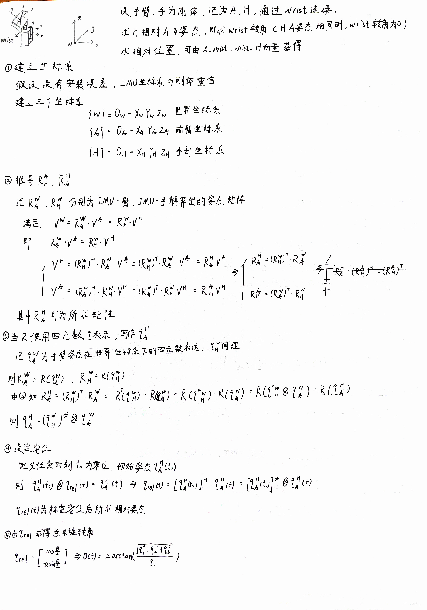
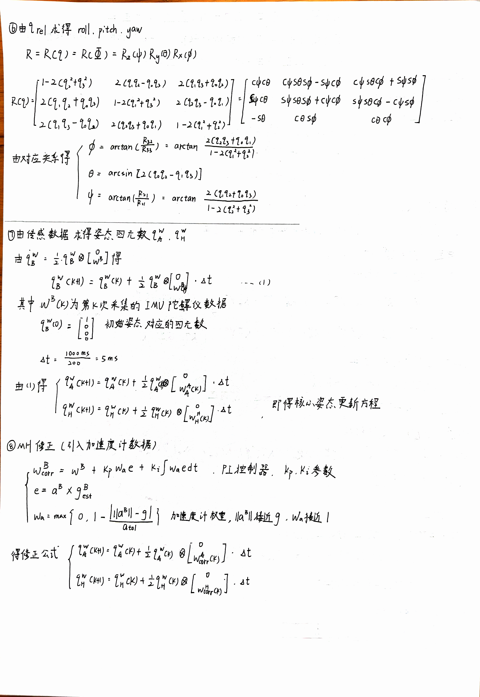
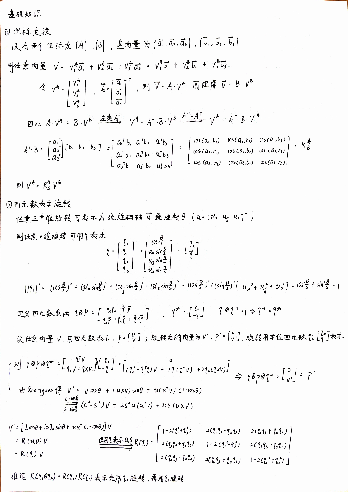
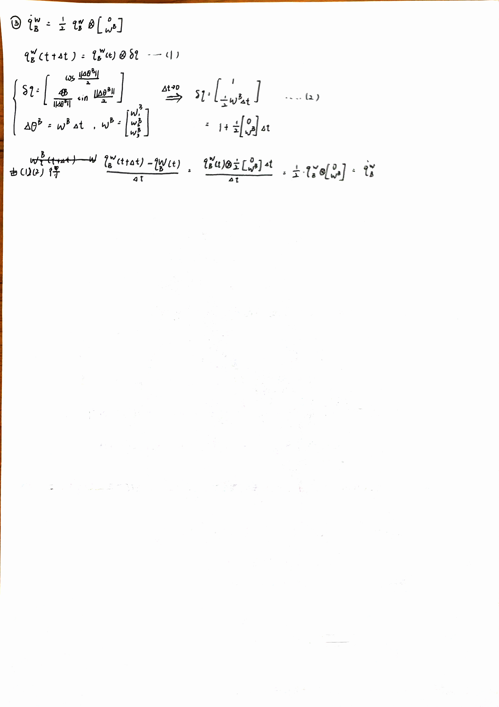

# IMU_WristAngle: Dual-IMU Wrist Relative Attitude Estimation

本项目面向“前臂 arm - 手部 hand”两刚体结构，使用两个 WT-IMU63 模块分别安装在 arm 端和 hand 端，实现 hand 相对于 arm 的实时相对姿态估计。项目包含 MATLAB 实物实验、Simulink 仿真、STM32F407 实时移植、MATLAB 实时可视化以及后续三自由度参考验证装置建模。

项目核心问题为：

[
{}^A q_H = ({}^W q_A)^{-1} \otimes {}^W q_H
]

其中，({}^W q_A) 表示 arm IMU 相对于世界坐标系的姿态，({}^W q_H) 表示 hand IMU 相对于世界坐标系的姿态，({}^A q_H) 表示 hand 相对于 arm 的相对姿态。

---

## Highlights

* 完成双 IMU 相对姿态的坐标系与四元数推导；
* 实现 WT-IMU63 串口数据解析，包括加速度、角速度、欧拉角和四元数数据帧；
* 在 MATLAB 中实现纯陀螺积分 GI 和自适应 Mahony / MH 姿态融合；
* 在 STM32F407ZGT6 上实现双 IMU 实时姿态解算；
* 使用 USART2 / USART3 分别接收 hand / arm IMU 数据，USART1 与 PC / MATLAB 通信；
* 使用 DMA + IDLE 接收 IMU 数据，并实现逐 gyro 帧姿态更新；
* 在 MATLAB 中实时显示相对 roll / pitch / yaw 和轴角 theta；
* 调研并初步设计三自由度球关节连续测角验证方案。

---

## System Overview

系统基本流程如下：

```text
hand IMU                  arm IMU
   │                         │
   │ USART2                  │ USART3
   └──────────┬──────────────┘
              │
        STM32F407ZGT6
              │
      WT-IMU63 数据解析
              │
      GI / Mahony / MH 姿态解算
              │
 q_rel = q_arm^{-1} ⊗ q_hand
              │
 roll / pitch / yaw / theta
              │
           USART1
              │
         MATLAB 实时显示
```

理论计算如下所示











---

## Repository Structure

```text
IMU_WristAngle/
├── experiment/              # MATLAB 实物实验代码
│   ├── LIBRARY/             # 串口解析、四元数运算、GI、MH、绘图函数
│   ├── test/                # 测试脚本
│   ├── GI_main.m            # 双 IMU 纯陀螺积分主脚本
│   └── MH_main.m            # 双 IMU 自适应 Mahony 主脚本
│
├── simulation/              # Simulink 双 IMU 手腕相对姿态仿真
│   ├── LIBRARY/             # 仿真工具函数
│   ├── SIMULINK/            # Simulink 模型
│   ├── motion_case/         # 预设运动案例
│   ├── init_wrist_imu_sim.m
│   └── post_wrist_imu_sim.m
│
├── mcu/                     # STM32F407 实时解算工程
│   └── STM32F407/           # Keil / CubeMX 工程文件
│
├── model/                   # SolidWorks / STL 打印件与验证装置模型
├── docs/                    # 推导文档、系统图、实验截图
├── references/              # IMU 手册、论文与相关资料
├── .gitignore
└── README.md
```

如果当前仓库中还没有 `mcu/`、`docs/` 或 `references/`，建议后续逐步整理。原有中文目录“调研资料”建议改为 `references/`，便于跨平台和开源展示。

---

## Hardware Setup

当前实物实验主要使用：

| Module        | Description            |
| ------------- | ---------------------- |
| IMU           | WT-IMU63               |
| MCU           | STM32F407ZGT6          |
| PC Software   | MATLAB                 |
| MCU IDE       | STM32CubeMX / Keil MDK |
| Communication | UART, 115200 baud      |

MATLAB 直连 IMU 实验中：

```text
COM5: hand IMU
COM6: arm IMU
```

STM32 实时实现中：

```text
USART2: hand IMU
USART3: arm IMU
USART1: PC / MATLAB
```

推荐 IMU 设置：

```text
输出内容：角速度 + 加速度
通信速率：115200
回传速率：200 Hz
带宽：188 Hz 或 98 Hz
```

若测试模块内置姿态算法，可设置：

```text
输出内容：四元数 / 欧拉角
通信速率：115200
回传速率：50 Hz 或 200 Hz
```

---

## Mathematical Formulation

建立三个坐标系：

```text
{W}: 世界坐标系
{A}: arm 坐标系
{H}: hand 坐标系
```

假设 IMU 坐标系与对应刚体坐标系重合，则两个 IMU 姿态分别为：

[
{}^W q_A
]

[
{}^W q_H
]

其中，({}^W q_A) 表示 arm 坐标系到世界坐标系的姿态四元数，({}^W q_H) 表示 hand 坐标系到世界坐标系的姿态四元数。

hand 相对于 arm 的相对姿态为：

[
{}^A q_H = ({}^W q_A)^{-1} \otimes {}^W q_H
]

对于单位四元数，有：

[
q^{-1} = q^*
]

因此：

[
{}^A q_H = ({}^W q_A)^* \otimes {}^W q_H
]

实际实验中，初始姿态不一定为零位，因此记录初始相对姿态：

[
{}^A q_{H,0} = {}^A q_H(t_0)
]

任意时刻相对于零位的姿态变化为：

[
q_{out}(t) = ({}^A q_{H,0})^{-1} \otimes {}^A q_H(t)
]

最终输出：

```text
roll / pitch / yaw
axis-angle theta
```

轴角 theta 由下式计算：

[
\theta = 2\operatorname{atan2}(|\mathbf q_v|, q_0)
]

其中：

[
q_{out} =
\begin{bmatrix}
q_0 \
\mathbf q_v
\end{bmatrix}
]

---

## Implemented Algorithms

### 1. WT-IMU63 Protocol Parser

已完成 WT-IMU63 串口数据帧解析，包括：

```text
0x51: acceleration
0x52: angular velocity
0x53: Euler angle
0x59: quaternion
```

相关 MATLAB 函数位于：

```text
experiment/LIBRARY/
```

主要包括：

```matlab
wit_parse_packet.m
wit_parse_stream.m
wit_read_gyro_acc.m
```

---

### 2. Quaternion Utilities

已实现常用四元数工具函数：

```matlab
quat_mul.m
quat_conj.m
quat_normalize.m
quat_to_eulZYX_deg.m
quat_to_axis_angle_deg.m
```

相对姿态计算核心为：

```matlab
qRel = quat_mul(quat_conj(qArm), qHand);
```

即：

[
q_{rel} = q_{arm}^{-1} \otimes q_{hand}
]

---

### 3. Gyro Integration, GI

GI 方法直接使用角速度进行四元数积分：

[
q_{k+1} = q_k \otimes \Delta q(\omega_k)
]

特点：

* 动态响应快；
* 无明显模块内置滤波滞后；
* 长时间运行会存在积分漂移；
* 静止时若角速度输出为 0，则不会继续漂移。

主脚本：

```matlab
experiment/GI_main.m
```

---

### 4. Adaptive Mahony / MH

自适应 Mahony / MH 在 GI 基础上引入加速度计修正：

```text
动态运动时：主要相信 gyro integration
低动态 / 接近静止时：使用 accelerometer 修正 roll / pitch
```

核心逻辑：

```text
如果 |norm(acc) - g| 较小，并且 norm(gyro) 较小：
    提高加速度计修正权重
否则：
    降低或关闭加速度计修正
```

加速度计可信度权重可以表示为：

[
w_a = \max\left(0,\ 1-\frac{||\mathbf a|-g|}{a_{tol}}\right)
]

修正角速度为：

[
\omega_{corr}
=============

## \omega_m

\hat b_g
+
K_p w_a e
+
K_i \int w_a e,dt
]

说明：

* MH 可以改善 roll / pitch 方向的长期漂移；
* 六轴 IMU 缺少绝对航向参考，因此无法从根本上消除 yaw 漂移；
* 当前版本中 `Ki` 默认关闭，以避免引入额外慢漂。

主脚本：

```matlab
experiment/MH_main.m
```

---

## MCU Real-Time Implementation

本项目已将双 IMU 相对姿态解算移植到 STM32F407ZGT6。

MCU 端功能包括：

* USART2 接收 hand IMU 数据；
* USART3 接收 arm IMU 数据；
* USART1 与 PC / MATLAB 通信；
* DMA + IDLE 接收 WT-IMU63 数据帧；
* 每解析到一个有效 gyro 帧，即进行一次 Mahony / MH 更新；
* MCU 端实时计算 hand 相对于 arm 的相对姿态；
* 实时输出 roll / pitch / yaw / theta；
* MATLAB 端仅负责接收、显示和发送置零命令。

当前串口输出格式示例：

```text
ATT,roll,pitch,yaw,theta,handCnt,armCnt,handBad,armBad,handOverflow,armOverflow,handHz,armHz,handDtErrUs,armDtErrUs
```

监测项包括：

```text
hand / arm gyro frame count
bad frame count
queue overflow
actual return frequency
average dt error
DMA receive statistics
```

该部分用于验证 MCU 端能否稳定完成实时双 IMU 姿态解算，而不是依赖 MATLAB 后处理。

---

## Realtime Visualization

MATLAB 实时显示模块位于：

```text
experiment/LIBRARY/imu_realtime_plot_init.m
experiment/LIBRARY/imu_realtime_plot_update.m
experiment/LIBRARY/imu_realtime_plot_reset.m
```

显示内容包括：

* hand IMU 3D attitude；
* arm IMU 3D attitude；
* relative Euler angles: roll / pitch / yaw；
* relative axis-angle rotation angle: theta；
* frame count / bad frame / overflow / dt error 等通信状态。

按键：

```text
z: reset zero pose / clear realtime curves
```

建议后续在 `docs/images/` 中添加实时显示截图：

```markdown

```

---

## Current Results and Observations

| Method               | Advantage           | Limitation        | Observation          |
| -------------------- | ------------------- | ----------------- | -------------------- |
| Built-in Quaternion  | 低速运动下较稳定            | 快速运动后存在滞后和 yaw 漂移 | 适合作为模块内置算法参考         |
| Gyro Integration, GI | 动态响应快               | 长时间运行存在积分漂移       | 快速运动跟随能力优于内置四元数      |
| Adaptive Mahony / MH | 可降低 roll / pitch 漂移 | 六轴条件下 yaw 仍缺少绝对参考 | 同刚体动态测试中残余角度低于纯 GI   |
| MCU Real-Time MH     | 可脱离 MATLAB 实时运行     | 仍需外部参考系统验证动态精度    | 已实现逐 gyro 帧更新和通信状态监测 |

当前阶段的实验现象：

1. 模块内置四元数在低速运动下表现较好，但快速动态运动后容易出现滞后和 yaw 漂移；
2. 纯 GI 方法动态跟随能力更好，但长时间动态运动后会累积误差；
3. 自适应 MH 通过在低动态阶段引入加速度计修正，可以降低 roll / pitch 漂移；
4. 在同刚体动态测试中，自适应 MH 的残余角度低于未修正的 GI；
5. STM32 端已经实现实时相对姿态解算，MATLAB 可实时显示相对欧拉角和轴角。

---

## Simulation

`simulation/` 中包含双 IMU 手腕相对姿态仿真框架，主要模块包括：

* 预定义手腕运动；
* IMU 测量模拟；
* 姿态解算；
* 相对姿态计算；
* 误差分析与后处理。

仿真部分用于在实物实验前验证算法逻辑和误差分析流程。

运行方式：

```matlab
cd simulation
addpath('LIBRARY')
init_wrist_imu_sim
```

运行 Simulink 模型后，执行：

```matlab
post_wrist_imu_sim
```

---

## CAD / Mechanical Model

`model/` 中包含 SolidWorks 零件文件和 STL 文件，用于：

* arm / hand 两侧 IMU 安装；
* 球关节实验装置建模；
* 三自由度连续测角验证装置概念设计。

后续验证装置的目标是为双 IMU 相对姿态估计提供外部参考，包括：

* 三自由度万向节参考平台；
* 三轴编码器 / Hall 角度传感器；
* 球关节连续三自由度测角结构；
* 视觉或非接触姿态参考方案。

建议后续添加模型截图：

```markdown

```

---

## How to Run

### MATLAB Experiment

进入 `experiment/` 目录：

```matlab
cd experiment
addpath('LIBRARY')
```

运行 GI：

```matlab
GI_main
```

运行自适应 Mahony / MH：

```matlab
MH_main
```

### MATLAB Simulation

进入 `simulation/` 目录：

```matlab
cd simulation
addpath('LIBRARY')
init_wrist_imu_sim
```

运行 Simulink 模型后处理：

```matlab
post_wrist_imu_sim
```

### MCU

进入 MCU 工程目录：

```text
mcu/STM32F407/
```

使用 Keil MDK 打开工程后：

1. 编译工程；
2. 下载到 STM32F407ZGT6；
3. 连接 hand IMU 到 USART2；
4. 连接 arm IMU 到 USART3；
5. 连接 PC / MATLAB 到 USART1；
6. 运行 MATLAB 实时显示脚本。

---

## Next Steps

后续计划：

* 增加 MATLAB 自动数据保存与离线误差分析；
* 统计 zero-return error、dynamic tracking error 和 long-term drift；
* 设计三自由度连续参考测角实验；
* 对比双 IMU 输出和外部参考角；
* 进一步研究球关节约束、回零约束和运动学约束在相对姿态估计中的作用。

---

## Notes

当前项目仍处于实验验证阶段，实时显示结果主要用于观察算法趋势。严格性能评价应基于保存数据后的离线分析，包括：

* final theta；
* max theta；
* RMS theta；
* relative Euler angle drift；
* zero-return error；
* dynamic response delay；
* long-term drift；
* dynamic tracking error。

---

## Author

Chen Shuyi
Wuhan University of Technology
Mechanical Design, Manufacturing and Automation

GitHub: [IdiotCSY](https://github.com/IdiotCSY)
